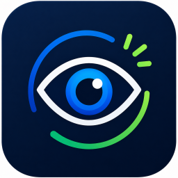

# 👀 DevEyes

<p align="center">
  
</p>

<h1 align="center">DevEyes</h1>

<p align="center">
Code Smarter. Blink Better. Stay Healthy.
</p>

<p align="center">
A lightweight Visual Studio Code extension that reminds developers to take regular eye breaks using the <b>20-20-20 Rule</b>, helping reduce digital eye strain and improve productivity.
</p>

---

# ✨ Features

* 👀 Smart eye-care reminders
* ⏰ Custom reminder intervals
* 🎯 Random eye exercises
* 📊 Interactive wellness dashboard
* 🔥 Daily streak tracking
* 📈 Statistics tracking
* 💾 Persistent data storage
* ⚙️ Settings panel
* 🗑 Reset statistics and streak
* 🎨 Modern, clean UI

---


---

# 🚀 Installation

## Install from Visual Studio Marketplace

Search for **DevEyes** in the Extensions Marketplace.

or

```text
Ctrl + Shift + X
Search: DevEyes
Click Install
```

---

## Install from VSIX

```bash
code --install-extension deveyes-1.0.0.vsix
```

---

## Build from Source

```bash
git clone https://github.com/Priyanka0920/DevEyes.git

cd DevEyes

npm install

vsce package
```

Press **F5** inside Visual Studio Code to launch the Extension Development Host.

---

# 🚀 Usage

Open the Command Palette:

```
Ctrl + Shift + P
```

Available commands:

* DevEyes: Start Reminder
* DevEyes: Stop Reminder
* DevEyes: Open Dashboard
* DevEyes: Open Settings

---

# 🛠 Tech Stack

* JavaScript (ES6)
* VS Code Extension API
* HTML
* CSS
* Node.js

---

# 📁 Project Structure

```
DevEyes
│
├── media
├── src
│   ├── dashboard
│   ├── reminder
│   ├── settings
│   ├── statistics
│   ├── analytics
│   └── extension.js
│
├── test
├── package.json
└── README.md
```

---

# 🛣 Roadmap

Planned features for future releases:

* Weekly wellness analytics
* Achievement badges
* Sound notifications
* Theme customization
* Cloud sync
* Smart break detection

---

# 🤝 Contributing

Contributions, ideas, and suggestions are always welcome.

1. Fork the repository
2. Create a feature branch
3. Commit your changes
4. Open a Pull Request

---

# 📄 License

This project is licensed under the MIT License.

---

# 👩‍💻 Author

**Priyanka**

GitHub: https://github.com/Priyanka0920

---

⭐ If you found DevEyes useful, consider giving the repository a star.
